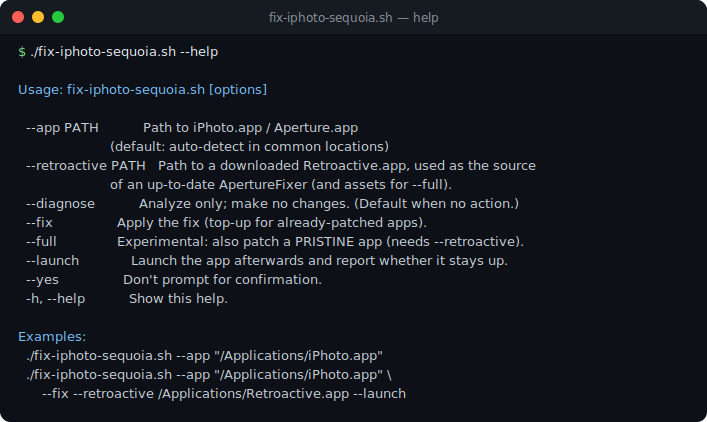

# macos-iphoto-fix

[](https://github.com/zanybaka/macos-iphoto-fix/actions/workflows/ci.yml)

Make Apple **iPhoto** (and **Aperture**) launch again on modern macOS — including
the frustrating case where you already ran **Retroactive** once, it worked, and
then a macOS upgrade silently broke the app again.



> Typical symptom on Sonoma / Sequoia:
>
> ```
> Termination Reason: Namespace DYLD, Code 4 Symbol missing
> Symbol not found: _OBJC_CLASS_$_NSRegion
>   Referenced from: .../iPhoto.app/Contents/Frameworks/ProKit.framework/.../ProKit
>   Expected in:     .../AppKit.framework/.../AppKit
> ```
>
> …or a crash a moment after launch inside
> `-[NSSegmentedControlAppearanceBasedVisualProvider updateSegmentItemConfiguration:]`.

This repo gives you a single script that **diagnoses** what your specific bundle
is missing on *your* macOS version and **repairs** it surgically, with a backup.

It ships **no Apple or Retroactive binaries** — only clean-room source. The
AppKit symbol shim is built on your machine from the source here; the runtime
fixer is read from a copy of **Retroactive** that *you* download.

---

## Why it breaks

iPhoto/Aperture are old 32/64-bit apps that link private AppKit classes Apple has
since removed. [Retroactive](https://github.com/cormiertyshawn895/Retroactive)
revives them by redirecting `ProKit` to a small **bundled AppKit shim** (which
re-exports the live system AppKit and stubs the removed classes) and by injecting
a **runtime fixer** (`ApertureFixer`) that patches changed AppKit behavior.

The catch: the set of *removed* classes grows with each macOS release. A bundle
patched in, say, 2023 stubs the classes that were gone *then*. When you upgrade
macOS and **another** private symbol disappears (`NSRegion` on Sequoia), the old
shim doesn't cover it and the app dies in dyld before it ever draws a window.
Separately, new AppKit internals (Sequoia's segmented-control rework) need a
**newer** `ApertureFixer` than the one already in your bundle.

A subtlety this tool gets right: the failing thing is the **exported symbol**
`_OBJC_CLASS_$_<X>`, not the class. On Sequoia `NSRegion`'s class still exists at
runtime, but its symbol is no longer exported, so the *static* two-level bind
fails. The correct test is therefore `dlsym("OBJC_CLASS_$_<X>")` in the **x86_64**
slice (the architecture the app actually runs in under Rosetta) — not
`NSClassFromString`, and not the arm64 slice (deprecated frameworks like QTKit
differ per-arch). The script uses exactly this test.

## What the script does

`fix-iphoto-sequoia.sh`:

1. **Detects** whether your app is pristine or already Retroactive-patched.
2. **Scans** every Mach-O in the bundle for the AppKit classes it imports, and
   uses an on-the-fly `dlsym` probe to find which `_OBJC_CLASS_$_` symbols are
   **missing on your current macOS/arch**.
3. For an **already-patched** app: backs it up, **rebuilds the bundled AppKit
   shim** so it stubs exactly those missing classes (re-exporting the live system
   AppKit for everything else), ad-hoc signs it, and — if you point it at your
   Retroactive copy — swaps in a **newer `ApertureFixer`** when yours lacks the
   current fixes.
4. For a **pristine** app: explains that the symbol shim can't help until ProKit
   is redirected, and points you to Retroactive (with an experimental `--full`
   mode that performs the redirection using your own Retroactive assets).
5. Optionally **launches** the app and reports whether it stays up.

## Requirements

- macOS (tested on Sequoia 15.7.5, Apple Silicon under Rosetta 2).
- Xcode Command Line Tools: `xcode-select --install`.
- A copy of **Retroactive** for the runtime fixer:
  <https://github.com/cormiertyshawn895/Retroactive> (download it; don't need to
  run it for the top-up path).
- Apple Silicon: Rosetta 2 (`softwareupdate --install-rosetta --agree-to-license`).

## Quick start



```bash
git clone https://github.com/zanybaka/macos-iphoto-fix.git
cd macos-iphoto-fix
chmod +x fix-iphoto-sequoia.sh

# 1) Diagnose (no changes). Auto-detects iPhoto/Aperture in common locations.
./fix-iphoto-sequoia.sh --app "/Applications/iPhoto.app"

# 2) Repair an already-Retroactive-patched app broken by a macOS upgrade:
./fix-iphoto-sequoia.sh --app "/Applications/iPhoto.app" \
    --fix --retroactive /Applications/Retroactive.app --launch
```

For a **pristine** (never-patched) app, run Retroactive first, then re-run with
`--fix` to top-up for your current macOS. Or try the experimental full patch:

```bash
./fix-iphoto-sequoia.sh --app "/Applications/iPhoto.app" \
    --full --retroactive /Applications/Retroactive.app --launch
```

## Safety

- Every `--fix`/`--full` run makes a **timestamped backup** of the whole app
  bundle next to it first (APFS clone when on the same volume — instant, cheap).
- The app is signed **ad-hoc** after edits; iPhoto/Aperture are x86_64 and run
  under Rosetta, where this is accepted.
- To revert: delete the patched app and rename the backup back.

## What never works (regardless of this fix)

- Apple's dead online services (Photo Stream, photo-book ordering, MobileMe).
- Anything depending on frameworks Apple fully removed for your arch.
  Your photos/library load fine; some features won't.

## Troubleshooting

**“`fix-iphoto-sequoia.sh` cannot be opened” / Gatekeeper blocks the app.**
The patched app is ad-hoc signed, not notarized. Launch it once via Finder →
right-click → **Open**, or clear the quarantine flag:
`xattr -dr com.apple.quarantine "/Applications/iPhoto.app"`.

**It exits immediately with no crash report.**
Usually Gatekeeper (see above), not a code failure. Confirm there's no new
`~/Library/Logs/DiagnosticReports/iPhoto-*.ips`; if there isn't, it's a launch
policy block, not a crash.

**A *new* `Symbol not found: _OBJC_CLASS_$_<X>` after a later macOS update.**
Expected — a newer OS dropped another private symbol. Just re-run
`./fix-iphoto-sequoia.sh --app … --fix --retroactive …`: the script re-detects
the now-missing classes and rebuilds the shim to cover them.

**“`warn` … NOT yet provided … : `<Foo>`” persists after `--fix`.**
The class is bound to a framework *other* than AppKit (the shim only serves the
AppKit namespace). Open an issue with the class name and the crash report; that
needs a separate shim.

**Crash right after launch in `NSSegmentedControl…updateSegmentItemConfiguration:`.**
Your `ApertureFixer` predates this OS. Pass `--retroactive /path/to/Retroactive.app`
so the script refreshes it; the latest Retroactive carries the Sequoia fix.

**`missing tool: clang/nm/codesign`.**
Install the Xcode Command Line Tools: `xcode-select --install`.

**`Rosetta 2 not detected` on Apple Silicon.**
`softwareupdate --install-rosetta --agree-to-license`.

**“library in use” / two iPhoto windows.**
Another iPhoto instance (or the original copy) is holding the library. Quit all
iPhoto instances and relaunch the patched one.

**Pristine app: diagnosis says it can't be topped up.**
Correct — the shim needs ProKit redirected first. Run Retroactive once, then
re-run this tool with `--fix`, or try the experimental `--full --retroactive …`.

## Credits

The hard part — the runtime fixer and the original revival approach — is
[**Retroactive** by cormiertyshawn895](https://github.com/cormiertyshawn895/Retroactive).
This project is a thin, transparent **top-up** for when a macOS upgrade outpaces
an existing patch. Please support Retroactive.

## Legal

- This project is MIT-licensed (see [LICENSE](LICENSE)) and covers **only its own
  code** — the AppKit shim source, scripts, and tools.
- **Retroactive has no published license** (no LICENSE file; all rights reserved).
  This project does **not** include, redistribute, or modify any Retroactive code
  or binaries. The script reads `ApertureFixer` from **your own** downloaded copy
  of Retroactive, on your machine, and writes only into **your own** app bundle.
- No Apple code or binaries are included or redistributed. Apple, iPhoto, Aperture,
  and AppKit are trademarks of Apple Inc.; this project is not affiliated with Apple.
  It is intended for personal interoperability use with software you already own.
- Please support the original project:
  <https://github.com/cormiertyshawn895/Retroactive>
